# 🛍️ Tienda - Gestión de Productos con Django y MySQL

Aplicación web desarrollada con **Django** que permite gestionar una lista de productos, sus categorías, etiquetas y detalles.  
Incluye operaciones **CRUD completas**, conexión a **MySQL**, y el uso del **ORM de Django** para realizar consultas avanzadas.

---

## 🚀 Características principales

- Conexión a base de datos **MySQL**
- Modelos relacionados:
  - **Producto** ↔ **Categoría** → Relación Muchos a Uno
  - **Producto** ↔ **Etiqueta** → Relación Muchos a Muchos
  - **Producto** ↔ **DetalleProducto** → Relación Uno a Uno
- Interfaz CRUD completa:
  - Crear, listar, editar y eliminar productos, categorías y etiquetas
- Consultas ORM con filtros, exclusiones y consultas personalizadas
- Uso del **Django Admin**
- Protección CSRF y middleware de seguridad activado

---

## 🗂️ Estructura del proyecto
```bash
tienda
 ┣ productos
 ┃ ┣ migrations
 ┃ ┣ templates
 ┃ ┣ admin.py
 ┃ ┣ apps.py
 ┃ ┣ forms.py
 ┃ ┣ models.py
 ┃ ┣ tests.py
 ┃ ┣ urls.py
 ┃ ┣ views.py
 ┃ ┗ __init__.py
 ┣ screenshots
 ┣ tienda
 ┃ ┣ asgi.py
 ┃ ┣ settings.py
 ┃ ┣ urls.py
 ┃ ┣ wsgi.py
 ┃ ┗ __init__.py
 ┣ manage.py
 ┣ README.md
 ┗ requirements.txt
```

---
## ⚙️ Instalación y configuración

### 1. Clonar el repositorio
```bash
git clone https://github.com/EstefanyRodriguezP/tienda.git
cd tienda
```
### 2. Crear y activar entorno virtual
```bash
python -m venv django_env
source django_env/Scripts/activate   # En Windows
# o
source django_env/bin/activate       # En macOS/Linux
```
### 3. Instalar dependencias
```bash
pip install -r requirements.txt
```
### 4. Configurar la base de datos MySQL
Asegúrate de tener MySQL en ejecución y crea la base de datos:
```bash
CREATE DATABASE IF NOT EXISTS tienda_db CHARACTER SET utf8mb4 COLLATE utf8mb4_unicode_ci;
USE tienda_db;
```
Edita tienda/settings.py con tus credenciales:
```bash
DATABASES = {
    'default': {
        'ENGINE': 'django.db.backends.mysql',
        'NAME': 'tienda_db',
        'USER': 'tu_usuario',
        'PASSWORD': 'tu_contraseña',
        'HOST': 'localhost',
        'PORT': '3306',
    }
}
```
### 5. Ejecutar migraciones
```bash
python manage.py makemigrations
python manage.py migrate
```
### 6. Crear superusuario
```bash
python manage.py createsuperuser
```
### 7. Ejecutar servidor
```bash
python manage.py runserver
```
Luego abre tu navegador en:
👉 http://127.0.0.1:8000/

---
## 🧩 Modelos implementados

### 🛒 Producto
- nombre: CharField
- descripcion: TextField
- precio: DecimalField
- categoria: ForeignKey → Categoria
- etiquetas: ManyToManyField → Etiqueta
- detalle: OneToOneField → DetalleProducto

### 🏷️ Categoría
- nombre: CharField
- Relación: una categoría puede tener muchos productos.

### 🔖 Etiqueta
- nombre: CharField
- Relación: un producto puede tener muchas etiquetas y viceversa.

### ⚙️ DetalleProducto
- nombre: CharField
- dimensiones: CharField
- Relación: uno a uno con Producto.

---

## 🧭 Rutas principales (URLConf)


| Ruta                        | Descripción         |
| --------------------------- | ------------------- |
| `/`                         | Página de inicio    |
| `/productos/`               | Lista de productos  |
| `/productos/crear/`         | Crear producto      |
| `/productos/<id>/`          | Detalle de producto |
| `/productos/<id>/editar/`   | Editar producto     |
| `/productos/<id>/eliminar/` | Eliminar producto   |
| `/categorias/`              | Lista de categorías |
| `/categorias/crear/`        | Crear categoría     |
| `/etiquetas/`               | Lista de etiquetas  |
| `/etiquetas/crear/`         | Crear etiqueta      |

---

## 🧠 Creación datos de ejemplo mediante ORM

### Creación de categorías
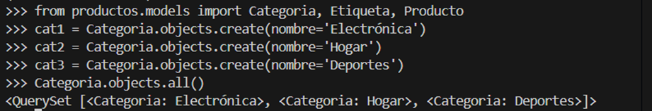
---
### Creación de etiquetas
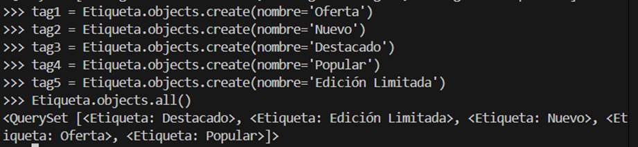
---
### Creación de productos
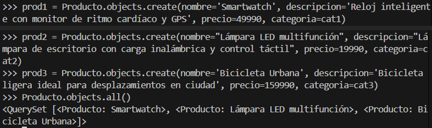
---
### Asociar etiquetas a los productos
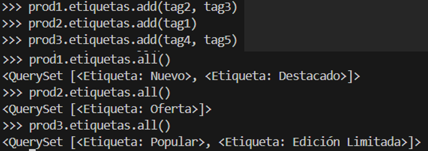
---
### Consultas de prueba
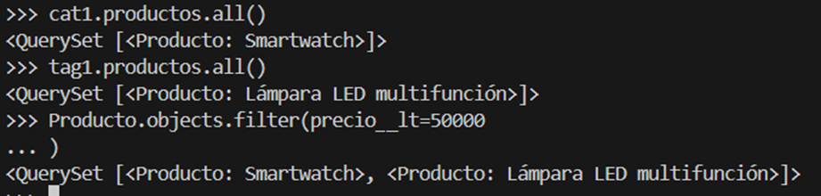


---

## 🧠 Otras consultas ORM de ejemplo

```bash
from productos.models import Producto, Categoria

# Filtrar productos por categoría
Producto.objects.filter(categoria__nombre="Electrónica")

# Productos con precio mayor a 50000
Producto.objects.filter(precio__gt=50000)

# Excluir productos de una categoría
Producto.objects.exclude(categoria__nombre="Hogar")

# Consultas con etiquetas
Producto.objects.filter(etiquetas__nombre="Oferta")

# Obtener productos ordenados por precio
Producto.objects.all().order_by('-precio')
```

---

## 🖼️ Capturas de pantalla

### Página de inicio
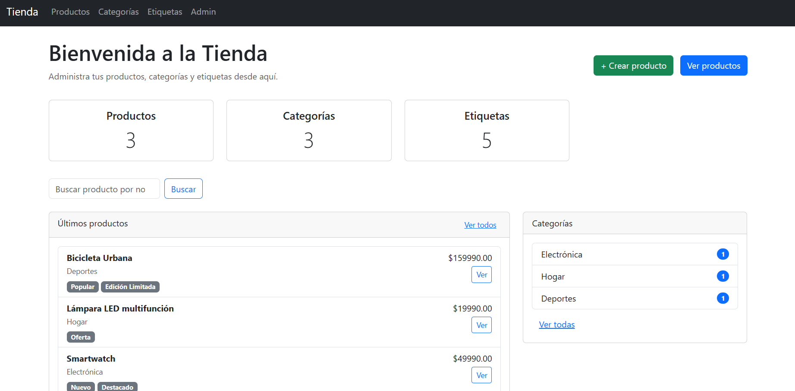
---
### Lista de productos
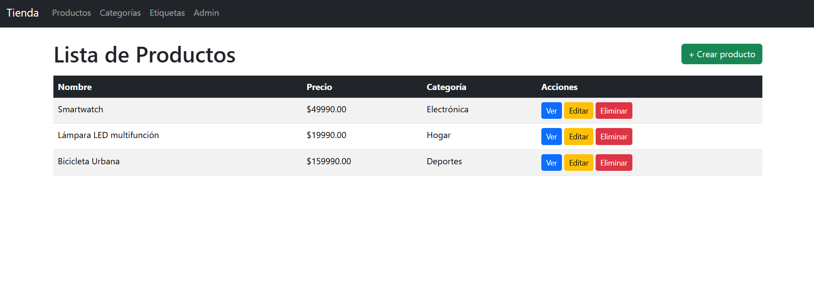
---
### Detalle producto
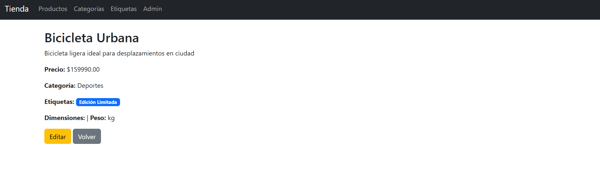
---
### Crear producto
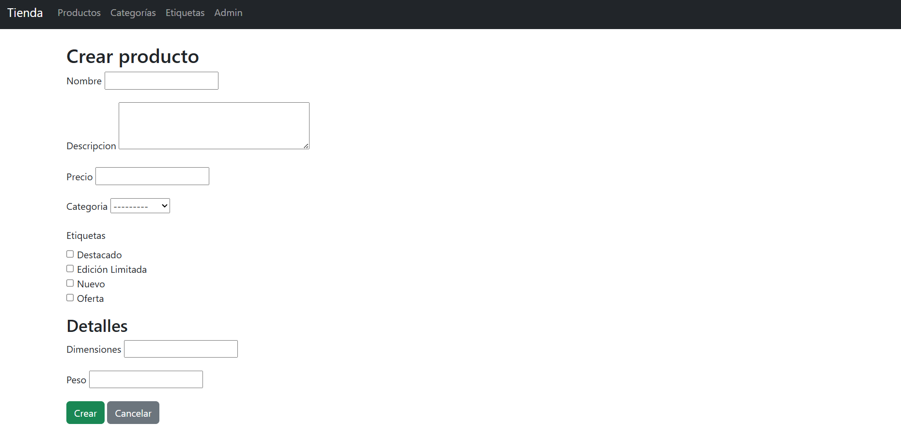
---
### Eliminar etiqueta
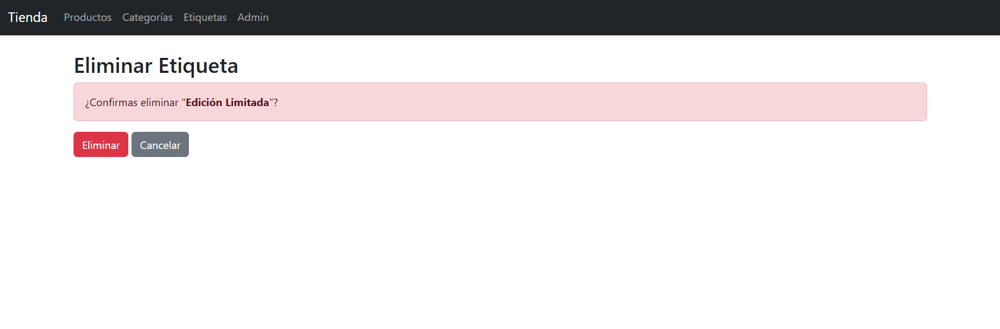
---
### Panel de administración
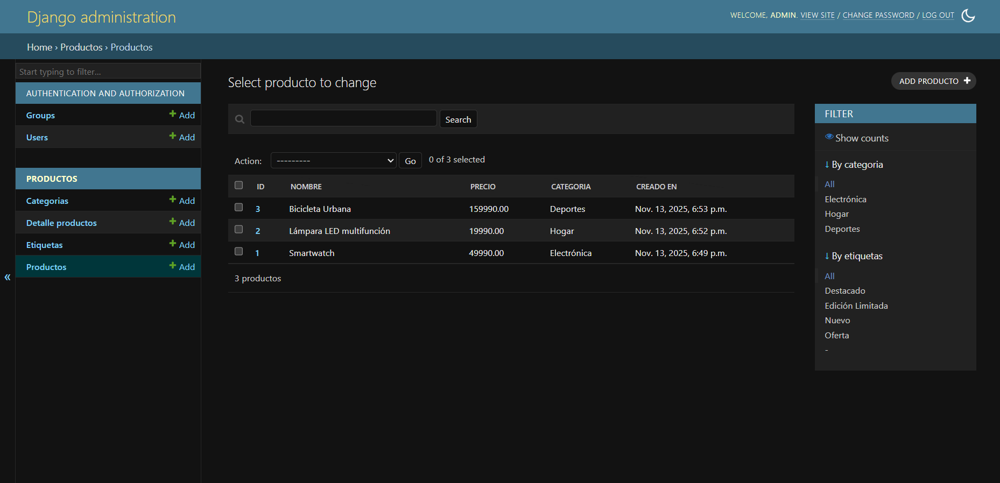


---

## 📚 Autor
👩‍💻 Estefany Rodríguez Pérez
Repositorio GitHub: EstefanyRodriguezP

---

## 🧾 Licencia
Este proyecto se entrega con fines educativos, como parte del proceso de evaluación del módulo Django del Bootcamp Full Stack Python.